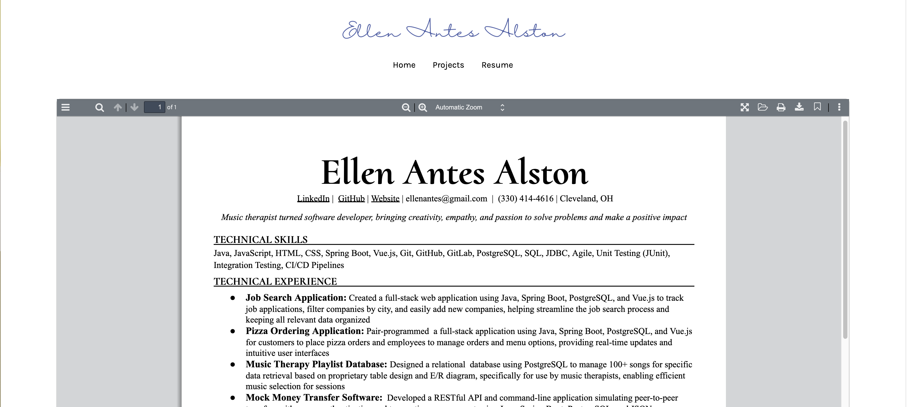

# Ellen Antes Alston Portfolio Project

## Overview

This project is a personal portfolio web application showcasing various skills, projects, and experiences of Ellen Antes Alston. The application is built using **Vue.js**, with the following features and components:

- A **dynamic homepage** with a welcoming message and introduction.
- A **projects section** showcasing different technical projects.
- A **resume view** with an interactive PDF viewer.
- A **responsive layout**, ensuring optimal display on various devices.

## Features

1. **Dynamic Home Page**
   - A welcoming section with a personal introduction (`Hello World, I'm Ellen Alston`).

2. **Projects Section**
   - Showcases various projects that demonstrate technical skills across web development and music therapy applications.
   - Each project has a title, description, skills used, and links to GitHub repositories and live demos when available.
   - Responsive grid layout for project cards.

3. **Resume Section**
   - Interactive **PDF Viewer** using **Vue-PDF-App** for viewing the resume.

4. **Routing and Navigation**
   - Utilizes Vue Router for navigation between pages (e.g., Home, Projects, Resume).
## Live Website
Please visit [www.ellenalston.com](http://www.ellenalston.com) to peruse for yourself!

## Images

